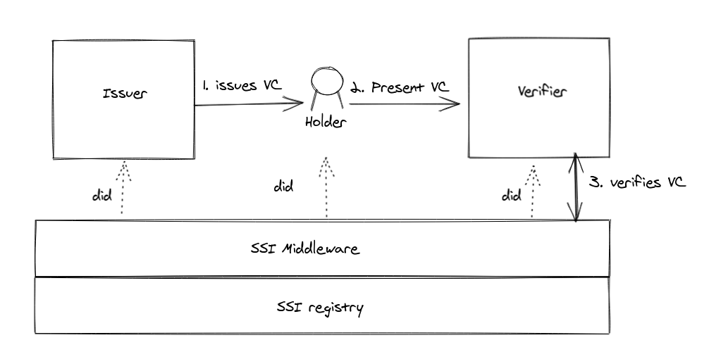

## SSI-Demo

Sample implementation of SSI protocol with [W3C specification](https://www.w3.org/TR/did-core/)

## Components

1. **Core**: Middleware to create did (i.e onboarding) and manages registry
2. **Issuers**: One who issue verifiable credentials.
3. **Verifier**: One who verifies verifiable credentials.

## Highlevel Architecture

- SSI Middleware: Manages the required list of APIs.
- SSI Registry: Stores the DID, DID-Doc, Schemea etc.

## Onboarding Flow

[Onboarding](ssi-infa/README.md)

## Issuance Flow

[Issuance](issuer/README.md)

## Verification Flow

[Verification](issuer/README.md)

## Reference

- https://www.w3.org/TR/vc-data-model/ 
- https://www.w3.org/TR/vc-imp-guide/ 
- [DID Implementation Guide v1.0](https://github.com/w3c/did-imp-guide)
- [Decentralized Identifier Specification v1.0](https://github.com/w3c/did-core)
- [Decentralized Identifier Core Registries v1.0](https://github.com/w3c/did-spec-registries)
- [Decentralized Identifier Use Cases v1.0](https://github.com/w3c/did-use-cases)
- https://livebook.manning.com/book/self-sovereign-identity/chapter-7/v-5/31
- https://www.w3.org/TR/vc-data-model/#lifecycle-details
- [Cryptographic Accumulator](https://medium.com/@aurelcode/cryptographic-accumulators-da3aa4561d77)