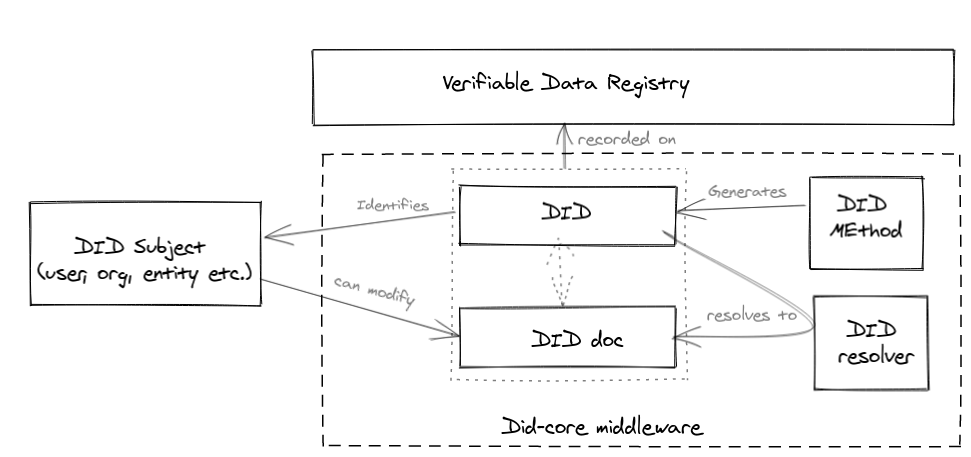

## DID-Core

This module has core implementation of SSI - The Decentralized Identitfier (DID) infrastructue. It follows the [W3C DID v1.0 specification](https://w3c.github.io/did-core/). The module mainly implements DID and DID doc. Basically, DID infrastructure can be thought of as a global key-value database in which the database is all DID-compatible blockchains, distributed ledgers, or decentralized networks. In this virtual database, the key is a DID, and the value is a DID document.

```
{"key": "value"}
 ______      _________
|      |    |         |
| DID  | => | DID Doc |
|______|    |_________|
```

### DID

A DID is a special type of identifier which identifies a subject (like a person, org, thing, data mode, absctract entity etc.) that the controller of the DID decides that it identifies. In contrast to typical, federated identifiers, DIDs have been designed so that they may be decoupled from centralized registries, identity providers, and certificate authorities.

Specifically, while other parties might be used to help enable the discovery of information related to a DID, the design enables the controller of a DID to prove control over it without requiring permission from any other party. And in many cases they can be fraudulently replicated and asserted by a malicious third-party ("identity theft"). 

DIDs are not created and maintained in a single type of database or network like most other types of URIs. There is no authoritative centralized registry—or a hierarchy of federated registries like DNS—where all DIDs are written and read.

A DID is a simple text string consisting of three parts, the: 

- URL scheme identifier (did)
- Identifier for the DID method
- DID method-specific identifier.

```js
did:example:123456789abcdefghi
```

Implementation detials can be found [here]().

**What problem does DID solves?**

> The vast majority of these globally unique identifiers (for passports, drivers licenses, tax IDs, health insurance, serial numbers, barcodes, RFIDs) are not under our control.  They may unnecessarily reveal personal information. 

> The Decentralized Identifiers (DIDs) defined in this specification are a new type of globally unique identifier designed to enable individuals and organizations to generate our own identifiers using systems we trust, and to prove control of those identifiers (authenticate) using cryptographic proofs (for example, digital signatures, privacy-preserving biometric protocols, and so on). 


### DID Doc

The DID resolves to [DID document](https://w3c.github.io/did-core/#dfn-did-documents). A DID document contains information associated with the DID, such as ways to cryptographically authenticate the DID controller, as well as services that can be used to interact with the DID subject.

```json
{
  "@context": "https://www.w3.org/ns/did/v1",
  "id": "did:example:123456789abcdefghi",
  "authentication": [{
    "id": "did:example:123456789abcdefghi#keys-1",
    "type": "Ed25519VerificationKey2018",
    "controller": "did:example:123456789abcdefghi",
    "publicKeyBase58": "H3C2AVvLMv6gmMNam3uVAjZpfkcJCwDwnZn6z3wXmqPV"
  }],
  "service": [{
    "id":"did:example:123456789abcdefghi#vcs",
    "type": "VerifiableCredentialService",
    "serviceEndpoint": "https://example.com/vc/"
  }]
}

```

## Architecutre

This module intracts with [VDR component](./src/cdr/README.md) to store the data.  The overall architecutre is as follows.




- **DID Subjects** :  A user, org, any other entity
- **Verifiable Data Registries** : Storage layer
- **DID documents** : Metadata associated with DID
- **DID Methods** :  Mechanism by which a particular type of DID and its associated DID document are created, resolved, updated, and deactivated.
- **DID resolver** : Software and/or hardware component that takes a DID as input and produces a conforming DID document as output. This process is called *DID resolution*. 


## DID creation flow


The entity that controls the DID and its associated DID document is called the DID controller. In many cases, this is the same as the DID subject, but they could also be different. An example is when a parent controls a DID that identifies their child—the DID subject is the child but the DID controller (at least until the child comes of age) is the parent.

Notes: 

- Here `Entity` could be any of the following: `A user`, `A issuer`, `A verfier`. They all has to be onboarded.
- [Here](https://sequencediagram.org/index.html#initialData=PTAOEMCcBcEsGNYQHbQAQEkDOWCuBTSAKBAhgSXFTQDVDYAzWQksKORFdAVS0IFoA6uAA2I-NCJE40cWgAiGeWgBK+AOaws0SODgB7ZGgYj9AdylkOlagFFUsaAE8iVilzQBlTxn4BZWAATQPEzKHwiexknfgA+b18A4NDwgC40YHhIfD18JVV8AEcCbTQAHSMABShwAFssdIBvNFBcACMRBABrfCc0AF8iZH1ofDR9ADdCLx9-IJD8MOz0gHF8ZEJcrAV8qkDy5G19bO3DNGzNbUgXBLnkxfC0fjiZ3zVLnSdUoZGxyenbu8tJ90p5oMd8NtoAALMaKZR7HbKeT6eBEQEaYHXJ5xW5JBZLfDpeHo2b4lLZHGxKKOL5IqQMxlAA) is the url to edit this image

## Installation


```bash
cd core
mv .env.sample .env
npm i
npm run dev 
npm run build 
npm run start
```


## API Usage


## Definition


A DID resolver is a software and/or hardware component that takes a DID (and associated options) as input and produces a conforming DID document (and associated metadata) as output. This process is called **DID resolution**. 

A DID URL dereferencer is a software and/or hardware component that takes a DID URL (and associated options) as input and produces a resource (and associated metadata) as output. This process is called **DID URL dereferencing**. 


## References

- https://livebook.manning.com/book/self-sovereign-identity/chapter-8/v-5/43
- https://github.com/WebOfTrustInfo/rwot6-santabarbara/blob/master/final-documents/did-auth.md#did-record-creation 
- https://w3c-ccg.github.io/security-vocab/
- [Git-did](https://github.com/decentralized-identity/github-did)

Important links:

- https://w3c.github.io/did-spec-registries/#properties
- https://www.w3.org/TR/did-core/#introduction
- [Quick read](https://w3c-ccg.github.io/did-primer/)
- [Did exchange](https://github.com/hyperledger/aries-rfcs/tree/master/features/0023-did-exchange)
- [JSON LD Vid](https://www.youtube.com/watch?v=vioCbTo3C-4)
- [JSON LD W3C spec](https://w3c.github.io/json-ld-syntax/)
- [Linked Data signature W3C spec](https://w3c-ccg.github.io/ld-proofs/)
- [Linked Data Signature vid](https://www.youtube.com/watch?v=QdUZaYeQblY&t=633s)
- [Verifiable Credential video](https://www.youtube.com/watch?v=eWtOg3vSzxI)
- [JSON web signature](https://tools.ietf.org/html/rfc7515)
- [JSON Web Key (JWK)](https://tools.ietf.org/html/rfc7517)
- [JSON serialiser rule](https://infra.spec.whatwg.org/#json)

https://identity.foundation/peer-did-method-spec/
https://stackoverflow.com/questions/58889992/key-differences-between-hyperledger-aries-and-hyperledger-indy 
https://stackoverflow.com/questions/56949519/why-do-we-need-distributed-ledgers-can-we-just-always-send-our-public-key-along 
Note:

> What is the problem that did solves?

The problem is simply this: how do you strongly bind a public key to its controller so that any party relying on that public key (the relying party) can be sure they are dealing with the real controller?

After all, if you can fool a relying party into accepting the public key for controller B when the relying party thinks it is the public key for controller A, then for all intents and purposes controller B can fully impersonate controller A.

Therefore, as a relying party, *it is essential to know you have the correct public key at the correct point in time* for any controller you are dealing with. 


