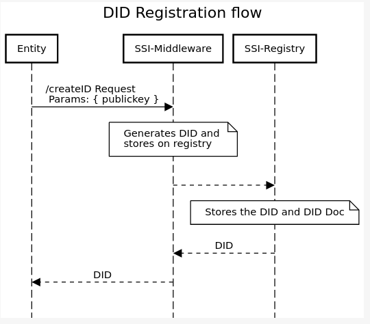

// middleware




Notes: 

- Here `Entity` could be any of the following: `A user`, `A issuer`, `A verfier`. They all has to be onboarded.
- [Here](https://sequencediagram.org/index.html#initialData=PTAOEMCcBcEsGNYQHbQAQEkDOWCuBTSAKBAhgSXFTQDVDYAzWQksKORFdAVS0IFoA6uAA2I-NCJE40cWgAiGeWgBK+AOaws0SODgB7ZGgYj9AdylkOlagFFUsaAE8iVilzQBlTxn4BZWAATQPEzKHwiexknfgA+b18A4NDwgC40YHhIfD18JVV8AEcCbTQAHSMABShwAFssdIBvNFBcACMRBABrfCc0AF8iZH1ofDR9ADdCLx9-IJD8MOz0gHF8ZEJcrAV8qkDy5G19bO3DNGzNbUgXBLnkxfC0fjiZ3zVLnSdUoZGxyenbu8tJ90p5oMd8NtoAALMaKZR7HbKeT6eBEQEaYHXJ5xW5JBZLfDpeHo2b4lLZHGxKKOL5IqQMxlAA) is the url to edit this image

## Installation


```bash
cd ssi-infra
mv .env.sample .env
npm i
npm run dev 
npm run build 
npm run start
```


## API Usage

